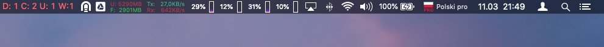
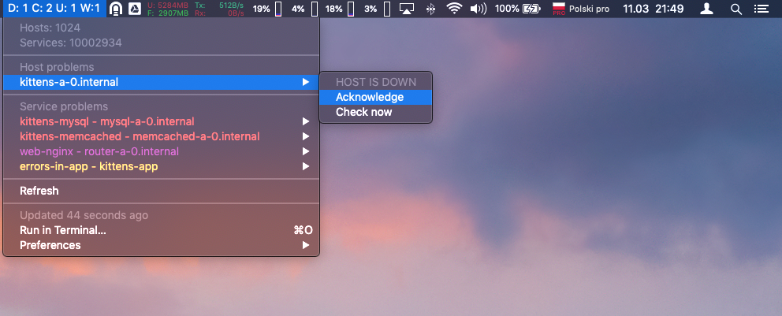

icinga2-bitbar
==============

This is [Icinga2](https://icinga.com) plugin for [Bitbar](https://github.com/matryer/bitbar). It is using Icinga2 API.

## Screenshots




## Features
* Show list of
  * Down hosts
  * Critical services
  * Unknown services
  * Warning services
* Acknowledge host/service problem
* Remove acknowledgment of host/service problem
* Reshedule check (re-check now)

## Requirements
* Python3
* requests

## Installaton (recomended)
Clone this repository
```bash
$ git clone https://github.com/SebastianCzoch/icinga2-bitbar.git
```

Install requirements
```bash
$ pip3 install -r requirements.txt
```

Modify `bitbar.py` and apply proper:
* `icinga2_address`
* `icinga2_user`
* `icinga2_password`

and if needed other available options

Create symlink to your BitBar plugin directory and make sure that it has executable privileges
```bash
$ ln -s ./bitbar.py <bitbar plugin directory>icinga2.10s.py
$ chmod +x <bitbar plugin directory>icinga2.10s.py
```

